# ahooks source code learning roadmap

> Based on the dependency graph of ahooks v3 source code, arranged in topological order
> to ensure all dependencies are mastered before studying each hook.

---

## Dependency graph overview

```mermaid
graph TB
    utils[utils] --> useCreation
    utils --> useMemoizedFn
    utils --> useMount
    utils --> useAsyncEffect
    depsAreSame --> useCreation
    useLatest --> useUnmount
    useLatest --> useDebounceFn
    useLatest --> useThrottleFn
    useLatest --> useRafInterval
    useLatest --> useRafTimeout
    useLatest --> useCountDown
    useLatest --> useEventTarget
    useLatest --> useGetState
    useLatest --> useEventListener
    useLatest --> useClickAway
    useLatest --> useKeyPress
    useLatest --> useFullscreen
    useLatest --> useLongPress
    useLatest --> useScroll
    useLatest --> useVirtualList
    useLatest --> useWebSocket
    useMemoizedFn --> useUpdate
    useMemoizedFn --> useSetState
    useMemoizedFn --> useSet
    useMemoizedFn --> useMap
    useMemoizedFn --> useCounter
    useMemoizedFn --> useSelections
    useMemoizedFn --> useInterval
    useMemoizedFn --> useTimeout
    useMemoizedFn --> useResetState
    useMemoizedFn --> useControllableValue
    useMemoizedFn --> useCookieState
    useMemoizedFn --> useHistoryTravel
    useMemoizedFn --> useFullscreen
    useMemoizedFn --> useVirtualList
    useMemoizedFn --> useWebSocket
    useMemoizedFn --> usePagination
    useMemoizedFn --> createUseStorageState
    useUnmount --> useDebounceFn
    useUnmount --> useThrottleFn
    useUnmount --> useRafState
    useUnmount --> useWebSocket
    useUpdate --> useReactive
    useUpdate --> useControllableValue
    useCreation --> useResetState
    useCreation --> useReactive
    useCreation --> useRequest
    useToggle --> useBoolean
    useBoolean --> useHover
    useUnmountedRef --> useSafeState
    createUpdateEffect --> useUpdateEffect
    createUpdateEffect --> useUpdateLayoutEffect
    useUpdateEffect --> useDebounceEffect
    useUpdateEffect --> useThrottleEffect
    useUpdateEffect --> createUseStorageState
    useUpdateEffect --> useVirtualList
    useUpdateEffect --> useRequest
    useDebounceFn --> useDebounce
    useDebounceFn --> useDebounceEffect
    useThrottleFn --> useThrottle
    useThrottleFn --> useThrottleEffect
    useRafState --> useMouse
    useRafState --> useSize
    useRafState --> useScroll
    useEventListener --> useHover
    useEventListener --> useMouse
    useEventListener --> useFocusWithin
    useEventListener --> useVirtualList
    useEventListener --> createUseStorageState
    useEventListener --> useInfiniteScroll
    useMount --> createUseStorageState
    useMount --> useRequest
    createUseStorageState --> useLocalStorageState
    createUseStorageState --> useSessionStorageState
    useRequest --> usePagination
    useRequest --> useInfiniteScroll
    useRequest --> useAntdTable
    useAntdTable --> useFusionTable
    useSize --> useVirtualList
```



---

## Phase 1: utils (zero dependencies, foundation of everything)

- [x] utils/index -- type guards: isFunction, isString, isNumber, isObject, isBoolean, isUndef, isNonNullable, isThenable
- [x] utils/isBrowser -- browser environment detection
- [x] utils/isDev -- development environment detection
- [x] utils/noop -- empty function placeholder
- [x] utils/depsAreSame -- shallow dependency comparison, used by useCreation
- [x] utils/domTarget -- BasicTarget type definition + getTargetElement, foundation for all DOM hooks
- [x] utils/lodash-polyfill -- re-export of lodash/debounce for environment compatibility

## Phase 2: core atomic hooks (minimal dependencies, widely referenced)

- [x] useLatest -- always holds the latest value via ref, depended on by 15+ hooks
- [x] useCreation -- factory initialization replacing useMemo/useRef, uses depsAreSame
- [ ] useMemoizedFn -- persistent function reference, uses isFunction + isDev
- [ ] useUnmount -- cleanup on unmount, depends on useLatest
- [ ] useMount -- callback on mount, uses isFunction + isThenable + isDev
- [ ] useUpdate -- force re-render, depends on useMemoizedFn
- [ ] useToggle -- toggle between two values, zero custom hook deps
- [ ] usePrevious -- retain previous render value, zero custom hook deps
- [ ] useUnmountedRef -- ref indicating unmount status, zero custom hook deps

## Phase 3: effect enhancement system

- [ ] useIsomorphicLayoutEffect -- SSR-safe useLayoutEffect, depends on isBrowser
- [ ] createUpdateEffect -- factory: skip-first-run effect, zero custom hook deps
- [ ] useUpdateEffect -- skip-first-run useEffect, depends on createUpdateEffect
- [ ] useUpdateLayoutEffect -- skip-first-run useLayoutEffect, depends on createUpdateEffect
- [ ] useAsyncEffect -- async effect with cancellation, depends on isFunction

## Phase 4: DOM effect infrastructure (unified effect pattern for DOM hooks)

- [ ] utils/createEffectWithTarget -- core: effect with DOM target support, uses depsAreSame + getTargetElement
- [ ] utils/useEffectWithTarget -- createEffectWithTarget + useEffect
- [ ] utils/useLayoutEffectWithTarget -- createEffectWithTarget + useLayoutEffect
- [ ] utils/useIsomorphicLayoutEffectWithTarget -- SSR-safe version
- [ ] utils/useDeepCompareWithTarget -- deep comparison + DOM target version
- [ ] useDeepCompareEffect -- deep compare useEffect, uses useDeepCompareWithTarget
- [ ] useDeepCompareLayoutEffect -- deep compare useLayoutEffect, uses useDeepCompareWithTarget

## Phase 5: simple state hooks (depend only on Phase 2)

- [ ] useBoolean -- boolean state, depends on useToggle
- [ ] useSafeState -- setState guarded against unmount, depends on useUnmountedRef
- [ ] useSetState -- class-style merge setState, depends on useMemoizedFn
- [ ] useGetState -- useState with getter, depends on useLatest
- [ ] useResetState -- resettable useState, depends on useMemoizedFn + useCreation
- [ ] useRafState -- requestAnimationFrame state updates, depends on useUnmount
- [ ] useCounter -- numeric counter, depends on useMemoizedFn
- [ ] useSet -- Set state management, depends on useMemoizedFn
- [ ] useMap -- Map state management, depends on useMemoizedFn
- [ ] useSelections -- list selection management, depends on useMemoizedFn
- [ ] useReactive -- reactive object via Proxy, depends on useCreation + useUpdate
- [ ] useControllableValue -- controlled/uncontrolled value, depends on useMemoizedFn + useUpdate
- [ ] useEventEmitter -- cross-component event bus, zero custom hook deps
- [ ] usePrevious (already in Phase 2 if not done there)
- [ ] useTrackedEffect -- track which deps changed, zero custom hook deps
- [ ] useLockFn -- lock async function to prevent concurrency, zero custom hook deps
- [ ] useWhyDidYouUpdate -- debug: trace re-render causes, zero custom hook deps

## Phase 6: timers, debounce, and throttle

- [ ] useTimeout -- setTimeout wrapper, depends on useMemoizedFn
- [ ] useInterval -- setInterval wrapper, depends on useMemoizedFn
- [ ] useRafInterval -- rAF-based interval, depends on useLatest
- [ ] useRafTimeout -- rAF-based timeout, depends on useLatest
- [ ] useCountDown -- countdown timer, depends on useLatest
- [ ] useDebounceFn -- debounced function, depends on useLatest + useUnmount + lodash/debounce
- [ ] useDebounce -- debounced value, depends on useDebounceFn
- [ ] useDebounceEffect -- debounced effect, depends on useDebounceFn + useUpdateEffect
- [ ] useThrottleFn -- throttled function, depends on useLatest + useUnmount + lodash/throttle
- [ ] useThrottle -- throttled value, depends on useThrottleFn
- [ ] useThrottleEffect -- throttled effect, depends on useThrottleFn + useUpdateEffect

## Phase 7: DOM interaction hooks (depend on DOM effect infrastructure)

- [ ] useEventListener -- unified event bindng, depends on useLatest + useEffectWithTarget
- [ ] useClickAway -- outside click detection, depends on useLatest + useEffectWithTarget
- [ ] useLongPress -- long press detection, depends on useLatest + useEffectWithTarget
- [ ] useInViewport -- viewport intersection, depends on useEffectWithTarget
- [ ] useTextSelection -- text selection tracking, depends on useEffectWithTarget
- [ ] useDrag -- drag source, depends on useLatest + useEffectWithTarget
- [ ] useDrop -- drop target, depends on useLatest + useEffectWithTarget
- [ ] useKeyPress -- keyboard event, depends on useLatest + useDeepCompareWithTarget
- [ ] useMutationObserver -- DOM mutation observation, depends on useLatest + useDeepCompareWithTarget
- [ ] useEventTarget -- form input value, depends on useLatest
- [ ] useHover -- hover state, depends on useBoolean + useEventListener
- [ ] useMouse -- mouse position, depends on useRafState + useEventListener
- [ ] useFocusWithin -- focus-within detection, depends on useEventListener
- [ ] useSize -- element size via ResizeObserver, depends on useRafState + useIsomorphicLayoutEffectWithTarget
- [ ] useScroll -- scroll position, depends on useRafState + useLatest + useEffectWithTarget
- [ ] useFullscreen -- fullscreen control, depends on useLatest + useMemoizedFn

## Phase 8: storage and state persistence

- [ ] createUseStorageState -- factory for storage hooks, depends on useEventListener + useMemoizedFn + useMount + useUpdateEffect
- [ ] useLocalStorageState -- localStorage state, depends on createUseStorageState
- [ ] useSessionStorageState -- sessionStorage state, depends on createUseStorageState
- [ ] useCookieState -- cookie state, depends on useMemoizedFn
- [ ] useHistoryTravel -- state history undo/redo, depends on useMemoizedFn

## Phase 9: environment, document, and network hooks

- [ ] useDocumentVisibility -- document visibility state, zero custom hook deps
- [ ] useNetwork -- network connection state, zero custom hook deps
- [ ] useTitle -- document title, depends on useUnmount
- [ ] useFavicon -- site favicon, zero custom hook deps
- [ ] useExternal -- dynamic external resource loading, zero custom hook deps
- [ ] useResponsive -- responsive breakpoints, depends on isBrowser
- [ ] useTheme -- theme detection, depends on useMemoizedFn
- [ ] useDynamicList -- dynamic list CRUD, depends on isDev

## Phase 10: useRequest (the most complex hook)

useRequest internal dependency structure:

```
useRequestImplement (core)
  |- useCreation
  |- useLatest
  |- useMemoizedFn
  |- useMount
  |- useUnmount
  |- useUpdate
  |- Fetch class
       |- isFunction

Plugins:
  |- useAutoRunPlugin -> useUpdateEffect
  |- useCachePlugin -> useCreation + useUnmount
  |- useDebouncePlugin -> lodash/debounce
  |- useLoadingDelayPlugin -> (no extra hook deps)
  |- usePollingPlugin -> useUpdateEffect
  |- useRefreshOnWindowFocusPlugin -> useUnmount
  |- useRetryPlugin -> (no extra hook deps)
  |- useThrottlePlugin -> lodash/throttle
```

- [ ] useRequest/src/utils -- isDocumentVisible, isOnline, subscribeFocus, subscribeReVisible, cache, limit
- [ ] useRequest/src/Fetch -- core Fetch class (state machine for request lifecycle)
- [ ] useRequest/src/useRequestImplement -- core implementation, integrates hooks + Fetch + Plugins
- [ ] useRequest/src/plugins/useLoadingDelayPlugin -- simplest plugin, no extra deps
- [ ] useRequest/src/plugins/useRetryPlugin -- retry logic
- [ ] useRequest/src/plugins/useCachePlugin -- caching, depends on useCreation + useUnmount
- [ ] useRequest/src/plugins/useDebouncePlugin -- debounce integration
- [ ] useRequest/src/plugins/useThrottlePlugin -- throttle integration
- [ ] useRequest/src/plugins/useAutoRunPlugin -- auto-run on deps change, depends on useUpdateEffect
- [ ] useRequest/src/plugins/usePollingPlugin -- polling, depends on useUpdateEffect
- [ ] useRequest/src/plugins/useRefreshOnWindowFocusPlugin -- refresh on window focus, depends on useUnmount
- [ ] useRequest -- entry point aggregating all plugins

## Phase 11: advanced hooks built on useRequest and DOM hooks

- [ ] usePagination -- pagination, depends on useRequest + useMemoizedFn
- [ ] useInfiniteScroll -- infinite scroll, depends on useRequest + useEventListener + useUpdateEffect + useMemoizedFn
- [ ] useAntdTable -- Ant Design table integration, depends on usePagination + useMemoizedFn + useUpdateEffect
- [ ] useFusionTable -- Fusion Design table integration, depends on useAntdTable
- [ ] useVirtualList -- virtual scrolling list, depends on useEventListener + useLatest + useMemoizedFn + useSize + useUpdateEffect
- [ ] useWebSocket -- WebSocket management, depends on useLatest + useMemoizedFn + useUnmount

---

## Study notes

1. Follow phase order strictly: hooks within a phase can be reordered, but phases have hard dependencies on previous ones
2. Five core hooks to master first: useLatest -> useMemoizedFn -> useUnmount -> useCreation -> useUpdate
3. useRequest is the watershed: phases 1-9 are foundations, useRequest is the capstone integrating all patterns
4. For DOM hooks, understand createEffectWithTarget first: this pattern is the key to all DOM-bindng hooks
5. Write tests for each hook you implement: the **tests**/index.spec.ts files in ahooks source are the best reference
